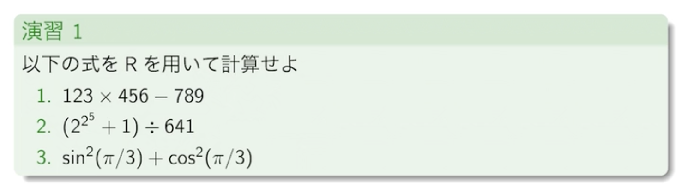

# 第一回講義：統計ソフトウェアR入門

## 1-2 基本的な使い方

### 式の入力


```{r}
# 2+27
1*2+3**3

(1+3) * (2+4) / 6

pi

print(pi, digits = 22) #桁数を指定

sqrt(2)

8**(1/3)

exp(10) #指数関数

log(8) # でふぉが自然対数

log(8,2) # 2引数で底を指定

sin(pi/2) # 三角関数 (sin, cos, tan)

sinpi(2/3) # sinpi(x) = sin(pi*x)

acos(1/2) # 逆三角関数 (asin, acos, atan)


``` 


### 数の扱い

```{r}

(1.5 + 3.5i) * (2-4i) # 複素数は数字にiをつける


-log(0) # 極限の扱いは計算ができる

3*log(0)

sqrt(-1) # 非数はNaN

```




```{r}
123 * 456 - 789


(2^(2^5) + 1) / 641

sin(pi/3)^2 + cos(pi/3)^2
```

### 変数代入

```{r}
x <- sin(pi/3)

x

y <- cos(pi/3)

y


z <- x - y 

z
```


## 1-3 データ構造

以下のデータ構造の使い方を学ぶ

* ベクトル
* 行列
* 配列(array)
* リスト
* データフレーム(df)

### 変数の型

```{r}

x <- 4


x^2

x^1000 # 実数として保持できる値を超えてInfとなる

y <- "foo" # 文字列は""
z <- "bar"

y

# 文字列の足し算はpaste, sepをなくせば文字列がくっつく
# y+z 文字列の四則演算はエラーになる
paste(y,z)
paste(y,z, sep ="")


# 論理値は数値変換で0, 1となる
as.numeric(TRUE)
as.numeric(F)

```

### ベクトル

* `c()`を使ってスカラーを並べてベクトルを使う
* `seq()`を使って規則的なベクトルを効率よく
* `10:1`のような範囲指定できる
* `rep()`で同じ値を繰り返すベクトルを効率よく
* `length()`でベクトルの長さ
* `rev()`で反転

```{r}
x <- c(0,1,2,3,4)

x

x[1] # 要素番号の指定めっちゃややこい

x[c(1,2,5)] # 要素番号の複数指定


y <- seq(0,3, by = 0.5) # 0~3を0.5刻みでスカラーを並べる


y


yy <- seq(0,3, length=5) #0~3を5つのスカラーになるように分割

yy

z <- 10:1 # 10~1の配列

z

z[3:8] # 範囲指定も同様にできる


a <- rep(1,7) # 1を7回繰り返す

a

b <- rep(c(1,2,3), times=3) #1,2,3を3回繰り返す

b

c <- rep(c(1,2,3), each=3)#1112とその値をeach分繰り返して次のスカラーに

c

d <- 1:20

length(d) # 20の長さをだす

rev(d)
```


### 行列

```{r}
x <- c(2,3,4,5,6,7)
matrix(x, 2,3) # 2*3行列に

X <- matrix(x, ncol=2) # 列数のみを指定して行数はよしなに
X

Y <- matrix(x,ncol=2, byrow=1) # 縦に値を入れて右シフトなのを行から挿入するように
Y


a <- c(9,8,7,6,5,4,3,2,1)
A <- matrix(a, 3,3)

A

nrow(A) # 行数
ncol(A) # 列数

A[1,2] # (1,2)成分で6
A[2,] # 2行目
A[,3] # 3列目

as.vector(A) # 行列をベクトルに


g <- c(1,1,1,2,2,2,3,3,3)
dim(g) <- c(3,3) # ベクトルを行列に

g

```

### リスト

異なるデータ構造を一つのオブジェクトにまとめて扱う

```{r}
L1 <- list(c(1,2,3,4), matrix(1:4, 2), c("おっぱい", "ぼいん"))

L1

L1[[1]] #リストの第一成分 

L1[[2]][1,2] # 第2成分の(1,2)の値

L1[[3]][[1]] # 第3成分の1つめの値


L2 <- list(Info = "第一回講義", List1 = L1) # 名前付き辞書形式

# 名前と各リストに格納されたデータ構造
L2
```

### データフレーム

```{r}
# 各項目が同じ長さのベクトルを並べる
x <- data.frame(
    # カラム名=その値
    month=c(4,5,6,7),
    price=c(900,1000,1100,1200),
    quantity=c(100, 80,90,20))

x

# 取り出しは行列と似ている

x[2,3]

x[,3]

x$month

rownames(x) # 行名の表示

rownames(x) <- c("Apr","May","Jun","Jul") # 行名の変更

x

colnames(x) #列名のひょうじ

x["Apr", "price"]
```


