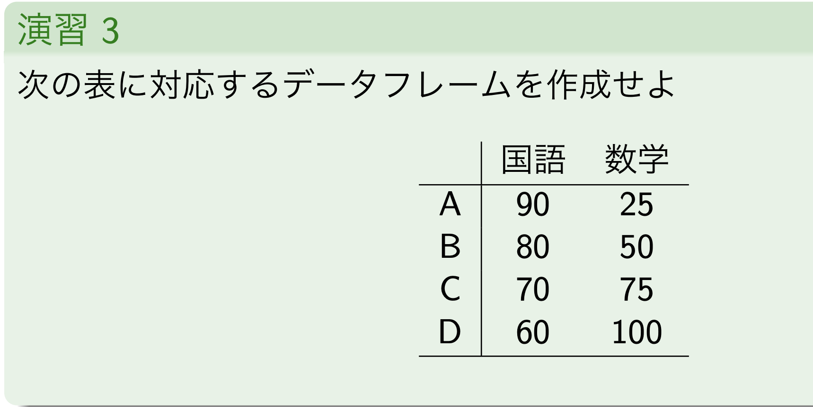

# 第二回講義

- 結構第二回でやっている内容を第一回講義のRmdファイルに記載があるのでそこは省略している
- 講義資料と配布資料があって配布資料が講義より先に進んでいるため上記のような不整合が発生した。この講義から**講義資料を基準にコーディングする**

### 演習1
以下に示すベクトルをRにおいて作成せよ.

1. (17,16, ..., 4,3) (17から3まで1ずつ減少していく要素をもつベクトル)
2. 1以上30以下の奇数を昇順に並べたベクトル
3. すべての要素が$\pi$からなる長さ 10 のベクトル

```{r}
vec1 <- 17:3
vec2 <- seq(1,30, by = 2)
vec3 <- rep(pi, 10)

vec1
vec2
vec3
```

### 演習2
行列A,Bを作成せよ
$$
A = \begin{pmatrix}
1 & 2 & 3 \\
4 & 5 & 6  
\end{pmatrix}
$$

$$
B = \begin{pmatrix}
3 & 0 & 0 \\
0 & 1 & 0 \\
0 & 0 & 4 
\end{pmatrix}
$$


```{r}
A <- c(1:6)
matrix(A, 2,3, byrow=1) 

B <- c(3,0,0,0,1,0,0,0,4)
matrix(B, 3,3)
```





```{r}

x <- data.frame(
  kokugo = c(90,80,70,60)
  , sugaku = c(25,50,75,100)
)

x
```

--- 

## 2.1. ベクトルの計算
### ベクトルの定義

```{r}
a <- 1:3
b <- 4:6

a
b
```

### ベクトルの和とスカラー倍
```{r}
a + b

# 長さの不整合は短いほうが周期的に拡張される
a + 1:6

a*2
``` 

### ベクトルの積

内積とアダマール積がある。


$$
内積 \\
\mathbf{a} \cdot \mathbf{b} = \sum_{i=1}^{n} a_i b_i = a_1 b_1 + a_2 b_2 + \cdots + a_n b_n
$$
アダマール積は対応する要素ごとの積

$$
アダマール積 \\
A \odot B = \begin{pmatrix}
a_{11}b_{11} & a_{12}b_{12} & \cdots & a_{1n}b_{1n} \\
a_{21}b_{21} & a_{22}b_{22} & \cdots & a_{2n}b_{2n} \\
\vdots & \vdots & \ddots & \vdots \\
a_{m1}b_{m1} & a_{m2}b_{m2} & \cdots & a_{mn}b_{mn}
\end{pmatrix}
$$

- コード

```{r}
# 内積
a %*% b

# アダマール積
a*b
```


### 初頭関数の適用

sinやexpなどの初等関数は成分毎の計算結果が返される。

```{r}
sin(a)

exp(a)

log(a)
```


## 2.2. 行列とその演算

基本的に行列でもベクトルと一緒`*`でアダマール積、`%*%`で行列積

### 行列の定義

```{r}
A <- matrix(1:6, nrow = 2, ncol = 3)
B <- rbind(c(2,3,5), c(7,11,13)) # 行でベクトルを結合2行3列になる
C <- cbind(c(0,0), c(0,1), c(1,0)) # 列ベクトルを結合して2行3列の行列ができる

A
B
C

A+B-C

```

### アダマール積、行列積

```{r}


A*B

C <- cbind(c(2,3,5), c(7,11,13))
C

#(2,3)と(3,2)で3の部分が揃って2*2の行列が積の結果となるよね
A%*%C

```

### 行列式ととトレース（対角成分の総和）


```{r}
tmp <- matrix(1:9, 3,3)
tmp

# 行列式 determinant
det(tmp) 

#トレース（対角成分の総和で1+5+9=15）
sum(diag(tmp))
```


