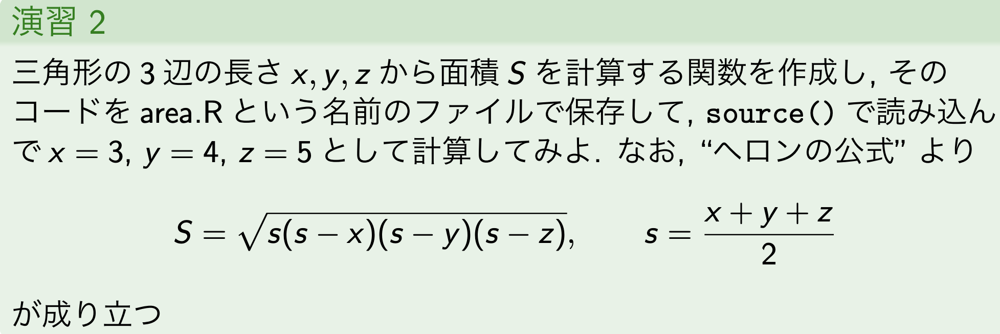
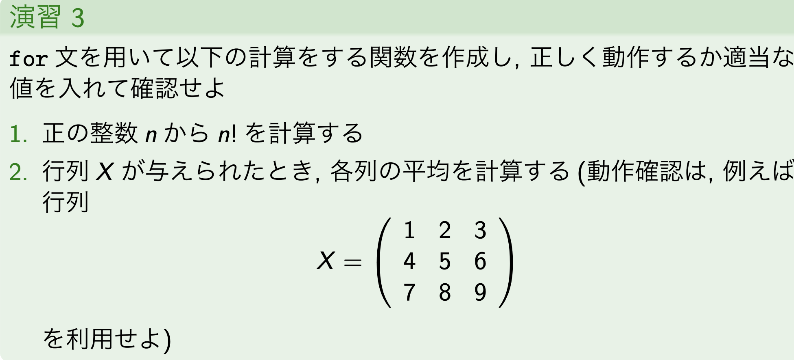

# 第三回講義

講義資料より逆行列の話から


### 逆行列

正方行列$A$が正則なら$A^{-1}$は`solve()`で計算できる

```{r}

A <- matrix(c(2,3,5,7,11,13,17,19,23), nrow=3, ncol = 3)

A
```

逆行列の計算

```{r}
B <- solve(A)

B
```

逆行列との積（浮動小数点演算による丸め誤差で厳密に対角成分以外が0にならない）

```{r}

A%*%B

B%*%A
```

### 関数定義

自作関数の定義には`function(r){}`で作成する

```{r}
# 半径rから球の体積と表面積を求める関数

myfunc <- function(r){
  V <- (3/4) * pi * r^3
  S <- 4 * pi *  r^2
  out <- c(V,S)
  
  names(out) <- c("volume", "area")
  
  return(out)
}

myfunc(2)
```




```{r}
prac2 <- function(x,y,z){
  s <- (x+y+z) / 2
  S <- sqrt(s*(s-x)*(s-y)*(s-z))
  
  return(S)
}

prac2(3,4,5)
```

### 制御文(いわゆるif, for, while)

### if文

```{r}

x <- 5

# 正負の判定
if(x>0) {
  print("positive")
} else {
  print("negative")
}

# 奇数の判定
if(x %% 2 == 1){
  print("odd")
} else {
  print("even")
}
```

### for文

```{r}
# 1~ 10の和を計算

y <- 0

for(i in 1:10){
  y <-y + i
}

print(y)
```



- 3-1
```{r}

prac3 <- function(n){
  res <- 1
  
  for(i in 1:n)
    res <- res*i 
  
  return(res)
}

prac3(4)

```

- 3-2

```{r}
# 行列の定義
X <- matrix(1:9, nrow = 3, byrow = TRUE)
X
```


```{r}
col_means <- function(X){
  n <- ncol(X) # 列数の取得
  out <- double(n) # double()で中の数分の0の配列を作成、今回ならn=3なのでout <- c(0,0,0)と同義
  
  for(i in 1:n){
    out[i] <- mean(X[,i]) # i列の全行をまとめて平均を求める、ってのをi列分繰り返してoutに格納
  }
  
  return(out)
}

col_means(X)
```

### 演習4

if 文を用いて, for 文の問題で作成した関数が以下の処理をできるように修正

- n = 0 の場合にも関数が正しく動作するようにする(0! = 1)


```{r}
prac4 <- function(n){
  if(n==0){
    return(1)
  }
  
  res <- 1
  
  for(i in 1:n)
    res <- res*i 
  
  return(res)
}

prac4(0)
prac4(4)

```


- X がベクトルの場合でも正しく動作するようにする

```{r}
# 行列の定義
X <- matrix(1:9, nrow = 3, byrow = TRUE)
X
```


```{r}
col_means <- function(X){
  # ベクトルは dim（次元属性）を持たないのを利用して、入力が行列かベクトルかを判定
  if(is.null(dim(X))){
    return(mean(X))
  }
  
  n <- ncol(X) # 列数の取得
  out <- double(n) # double()で中の数分の0の配列を作成、今回ならn=3なのでout <- c(0,0,0)と同義
  
  for(i in 1:n){
    out[i] <- mean(X[,i]) # i列の全行をまとめて平均を求める、ってのをi列分繰り返してoutに格納
  }
  
  return(out)
}


X_vec <- c(1, 2, 3)

col_means(X)
col_means(X_vec)
```


### while文

```{r}
# zが100より大きくなるまで*2を繰り返す

z <- 1
n <- 0

while(z<100){
  z <- 2 * z
  n <- n + 1
}

print(z) # 超えたときのzの値
print(n) # 超えたときの繰り返し回数
```

### 演習5

- 正の整数n からn! を計算する

```{r}
n <- 3
kai <- 1

while(n>1){
  kai <- kai * n
    
  n <- n-1
}

print(kai)
```

### データの抽出

pythonのpandasでインデックス指定するやつのノリ

#### vector

```{r}
# ベクトル
x <- c(10,15,20,25,30,35,40,45,50,55)
x

# 5番目と2番目を指定順に取り出す
x[c(5,2)]

# 2,3,7番目以外を抽出
x[-c(2,3,7)]

# 30より大きい要素はTRUE
idx <- (x >30)
idx #判定
x[idx]#TRUE判定の要素

# リストの5番目と2番目の要素を置換
x[c(5,2)] <- c(0,1)
x

```


#### data frame

Rの標準パッケージである datasets に含まれる airqualityは、1973年5月から9月までのニューヨークにおける大気状態を記録したデータセット


| 変数名 | 内容 | 単位 | 型 | 備考 |
| :--- | :--- | :--- | :--- | :--- |
| **Ozone** | オゾン濃度 | ppb | numeric | 欠損値(NA)あり。対数変換が検討されることが多い。 |
| **Solar.R** | 日射量 | lang | numeric | 欠損値(NA)あり。 |
| **Wind** | 平均風速 | mph | numeric |  |
| **Temp** | 最大気温 | °F | numeric | 華氏（摂氏への換算は $(F - 32) / 1.8$） |
| **Month** | 観測月 | 5-9 | integer | 5月〜9月の5ヶ月間 |
| **Day** | 観測日 | 1-31 | integer | 各月の日付 |


### データの構造把握
```{r}
# 行列のかず
dim(airquality)

# カラム名
names(airquality)
```


```{r}
# 最初の6行
head(airquality)
```


```{r}
# オブジェクト構造
str(airquality)
```


```{r}
# 行抽出
airquality[which(airquality$Ozone > 100), ]
```


```{r}
# 列も指定する
airquality[which(airquality$Ozone>100), c("Month", "Day")]
```

### subset()

複雑な抽出条件でもわかりやすく

```{r}
subset(airquality, Ozone>100)
```

```{r}
# カラムをwind〜dayカラムを指定
subset(airquality, Ozone>100, select = Wind:Day)
```

```{r}
# オゾンカラムに欠損がなくてdayが1か2のデータ
subset(airquality, !is.na(Ozone) & Day %in% c(1,2))
```

```{r}
# オゾン120以上もしくはTemp(気温)が95以上
subset(airquality, Ozone>120 | Temp >=95)
```

```{r}
# dayが1なものでtemp以外の列をすべて
subset(airquality, Day == 1, select = -Temp)

```

### 演習 7

R の組込データセット airqualityから以下の条件を満たすデータを取り出せ.

- 7 月のオゾン濃度 (Ozone)

```{r}
head(subset(airquality, Month == 7, c("Month", "Ozone")))
```


- 日射量 (Solar.R) に欠測 (NA) がないデータの月 (Month) と日 (Day)

```{r}
head(subset(airquality, !is.na(Solar.R), c("Month","Day")))
```


- 風速 (Wind) が時速 10 マイル以上で, 気温 (Temp) が華氏 80 度以上の日

```{r}
head(subset(airquality, Wind >= 10 & Temp >=80))
```

